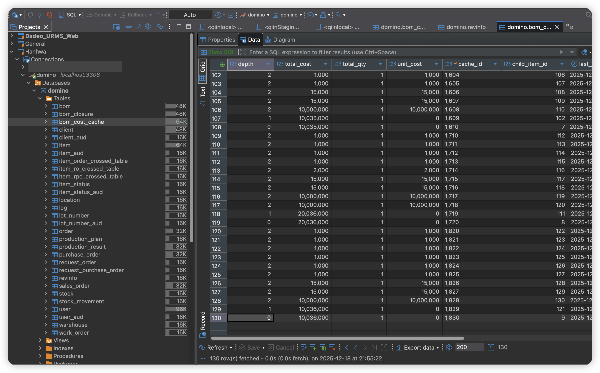
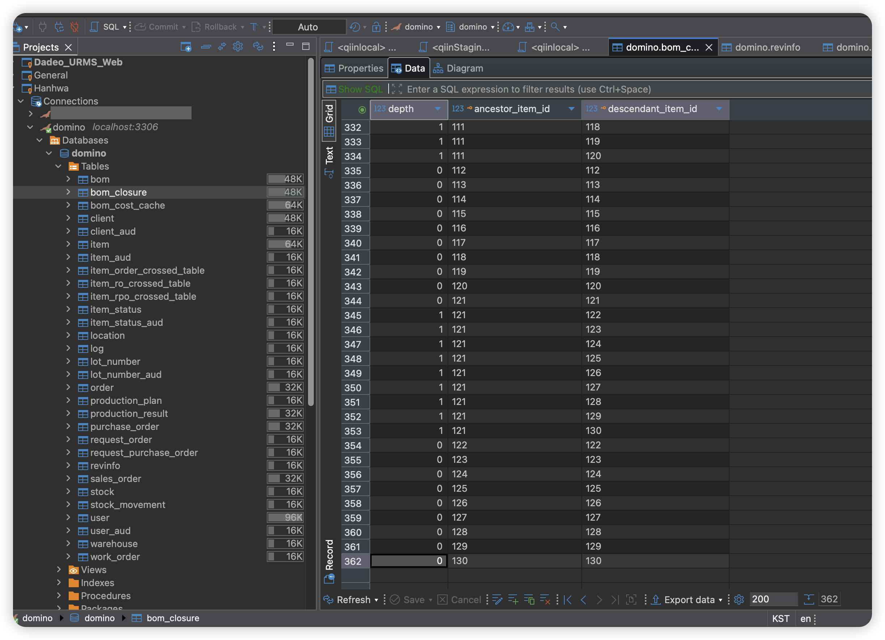
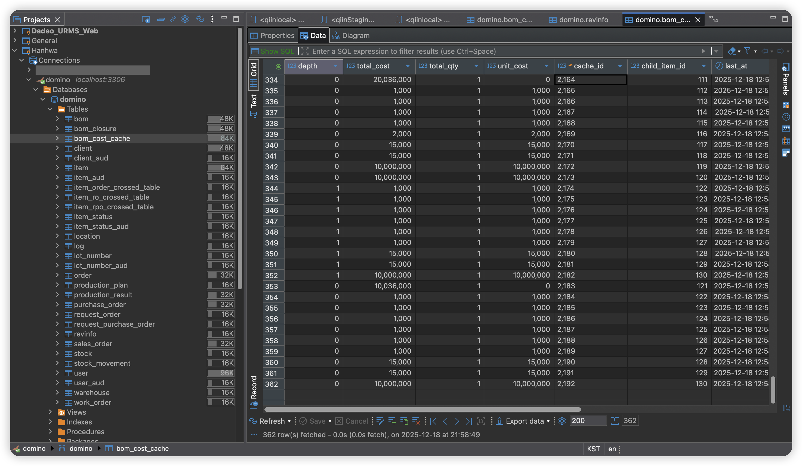

## 1. 결론 요약

ERP 스타일 BOM 원가 계산 시스템에서 `BOM` 생성/수정 시마다 `bom_cost_cache`를 자동 재빌드하도록 설계한 결과, 데이터 일관성 붕괴, 대량 처리 시 성능 저하, SRP(단일 책임 원칙) 및 트랜잭션 경계 위반이 동시에 드러났다. 동일 시점에 `bom_closure`는 362행, `bom_cost_cache`는 130행만 존재하는 정량적 불일치를 통해, BOM 구조 변경을 원가 계산의 자동 트리거로 사용하는 설계가 ERP 도메인에서는 근본적으로 잘못되었다는 점이 확인되었다. 최종적으로는 `bom_cost_cache`를 **Invalidate-only 캐시**로 다루고, `BOM Closure`는 구조 변경 시점에 **Upsert 방식으로 관리**하는 구조를 선택하여, 캐시는 트리거만 기록하고 실제 DFS 기반 재계산은 명시적 비즈니스 연산으로 분리함으로써 데드락, 성능 저하, 데이터 불일치를 동시에 해소했다.

---

## 2. Context & Issue

### 2.1 도메인 및 시스템 배경

- **도메인**: ERP 스타일의 BOM(자재명세서) 및 원가 계산
  - `Item`: 품목
  - `BOM`: 부모–자식 관계로 표현되는 자재 구조
  - `BOM Closure`: 전개/역전개를 위한 클로저 테이블
  - `bom_cost_cache`: BOM 구조와 품목 단가를 기반으로 계산된 **소요량/원가 결과를 물리 테이블에 저장**하는 계산 결과 저장소
- **역할 분리의 원칙 (이상적인 상태)**  
  - `BOM` 생성/수정/삭제는 **구조(Structure) 정의·변경 작업**이어야 한다.
  - 원가/소요량 계산은 “원가 산출”, “BOM 원가 재계산”, “결산용 계산 실행”과 같은 **별도의 비즈니스 연산(use case)**이어야 한다.

### 2.2 초기 설계 의도와 문제화된 전제

- 설계 의도:
  - “BOM을 수정하면 즉시 계산 결과도 최신이면 좋겠다”는 UX 요구를 반영.
  - BOM 변경(create/update/delete) 시 이벤트/서비스를 통해 `bom_cost_cache`를 **자동 무효화 + 재계산**.
  - BOM 변경 트랜잭션은 빠르게 커밋하고, 무거운 계산은 별도 비동기 워커에서 실행해 응답 속도 개선.
- 문제화된 전제:
  - “항상 최신 원가 제공”을 **도메인 불변 규칙**처럼 해석.
  - ERP에서 결산·감사 대상인 원가 계산을, 일반 웹 서비스의 **캐시 동기화/무효화 문제**와 동일 선상에서 다룬 것이 출발점이었다.

---

## 3. Phenomenon with Evidence

### 3.1 정량적 증거: 130행 vs 362행

동일 시점에 `bom_cost_cache`와 `bom_closure`를 비교하면, 전면 재빌드 전에는 `bom_cost_cache`가 130행, `bom_closure`가 362행으로 나타난다. 전면 재빌드 API(`POST /api/v1/boms/cache/rebuild`)를 실행한 이후에는 `bom_cost_cache` 행 수가 362행까지 증가하여 `bom_closure`와 동일한 스케일을 가지게 된다. 이 수치는 자동 재빌드 및 조회 시점 계산만으로는 전체 BOM 구조에 대한 완전한 계산 테이블을 유지할 수 없고, 명시적인 전체 재빌드가 있어야만 구조와 계산 결과가 일치한다는 점을 보여준다.

아래 스크린샷은 이 정량적 불일치를 테이블 레벨에서 시각적으로 확인할 수 있게 한다.

위 화면은 재빌드 이전의 `bom_cost_cache`를 보여 주며, 일부 루트 품목에 대해서만 원가 계산이 수행되어 총 **130행**만 존재한다. BOM 구조 전체에 대한 계산이 아니라, 과거에 부분적으로 계산되었던 루트들만 결과가 남아 있는 **부분 상태(partial state)**임을 알 수 있다.

동일 시점의 `bom_closure` 화면에서는 전체 BOM 구조가 **362행**으로 채워져 있어, 구조 정보(closure)는 충분히 축적되어 있음을 확인할 수 있다. 이는 구조 정의 계층은 이미 전체 BOM을 반영하고 있는데, 계산 결과 테이블(`bom_cost_cache`)이 그 절반 이하만 채워져 있다는 사실을 수치와 함께 시각적으로 보여 준다.

전면 재빌드 API를 명시적으로 호출한 이후의 `bom_cost_cache` 화면에서는 행 수가 **362행**으로 증가하여 `bom_closure`와 거의 1:1에 가까운 수준으로 맞춰진다. 이 스크린샷은 현재 구조에서 **수동 전체 재빌드 후에야** 계산 결과 테이블이 구조 테이블과 동일한 스케일로 채워진다는 점, 그리고 기존의 자동/부분 재빌드 설계가 전체 일관성을 보장하지 못한다는 점을 명확히 드러낸다.

### 3.2 운영/테스트 환경에서 반복 관측된 패턴

- 여러 차례 BOM 생성·수정 이후:
  - `bom_closure`:
    - BOM 구조 전체를 잘 반영하며 **약 362행**을 유지.
  - `bom_cost_cache`:
    - 일부 루트/경로만 계산되어 **약 130행 수준**에 머무름.
- 전면 재빌드 실행 시:
  - `bom_cost_cache`가 **130 → 362행**으로 증가.
  - 그제서야 `bom_closure`와 구조적으로 유사한 범위를 커버하는 결과 테이블이 형성된다.
- 사용자 관점:
  - “BOM을 정상적으로 수정했는데 화면의 원가/소요량 구조가 일부만 계산된 것처럼 보인다.”
  - “결국 매번 전면 재빌드를 눌러야 데이터가 맞는다.”
  - 시스템이 **스스로 일관성을 유지하지 못한다는 불신**으로 이어진다.

---

## 4. Root Cause Analysis (Technical)

### 4.1 “BOM 생성/수정 = 원가 계산 트리거”라는 잘못된 도메인 모델링

- 설계 상 전제:
  - “BOM이 변경되면 곧바로 원가도 최신 상태여야 한다.”
  - 따라서 BOM 변경을 **원가 계산 트리거**로 사용.
- ERP 도메인 특성:
  - BOM 변경은 **구조 정의 작업**이다.
  - 원가 계산은 결산 시점/기간/단가 기준 등 다양한 파라미터를 가진 **독립된 비즈니스 연산**이다.
- 결론:
  - BOM 변경과 원가 계산을 하나의 자동 플로우로 강결합한 것은 **도메인 모델링 레벨의 오류**였다.

### 4.2 구조 변경 + 클로저 재구성 + 캐시 재빌드의 강한 결합과 SRP 위반

- BOM 생성/수정 시 한 흐름 안에서:
  1. `bom` 테이블 업데이트
  2. `BomClosure` 재구성
  3. `bom_cost_cache` 재빌드
- 이 세 단계를 단일 파이프라인으로 엮은 결과:
  - 클로저 구조가 조금만 바뀌어도 전체 캐시를 다시 빌드해야 하는 형태로 동작.
  - 구조 책임(closure)과 계산 책임(cache) 경계가 흐려짐.
- **SRP(Single Responsibility Principle) 관점**:
  - BOM 도메인 서비스가:
    - 구조 정의·검증, 클로저 관리
    - 원가 계산 트리거 및 캐시 재빌드 호출
    - 두 도메인(구조, 원가)의 책임을 동시에 떠안게 되었고,
  - 이로 인해 단일 책임 원칙이 무너지고, 변경·장애의 영향 범위가 과도하게 커졌다.

### 4.3 트랜잭션 경계와 비동기 이벤트의 미정렬

- 트랜잭션 구조:
  - BOM 변경: 하나의 트랜잭션에서 커밋.
  - 원가 캐시 재빌드: 별도 비동기 워커, 별도 트랜잭션에서 실행.
- 이 구조가 만든 문제:
  - BOM 변경과 원가 계산이 **동일한 BOM/Item 스냅샷**을 기준으로 실행된다는 보장이 없다.
  - BOM이 연속적으로 수정되는 동안, 앞서 큐잉된 재빌드 작업이 **뒤늦게 실행**될 수 있다.
  - “이 원가가 정확히 어느 시점의 BOM 구조와 단가를 기준으로 계산되었는지”를 서비스 동작만 보고는 알 수 없다.
- 요약:
  - 트랜잭션 경계가 도메인 경계와 정렬되어 있지 않고,
  - 비동기 이벤트는 단순한 작업 큐 수준으로만 사용되며 **버전·스냅샷 개념이 전혀 없었다**.

### 4.4 조회 시점 자동 계산과 책임 경계 혼란

- 일부 조회 로직:
  - `bom_cost_cache`가 비어 있을 경우, **조회 시점에 즉시 계산 + 저장**.
- BOM 변경 기반 비동기 재빌드 + 조회 시점 계산이 섞이면서:
  - “어떤 호출이 실제로 원가를 계산해서 저장했는지”
  - “새로운 BOM 기준인지, 이전 BOM 기준인지”
  - 를 구분하기 어려워졌다.
- 결과:
  - 조회 레이어에 계산 책임이 숨어들어,
  - 디버깅과 원인 분석 시 **계층 간 책임 추적이 매우 어려운 구조**가 되었다.

### 4.5 `bom_cost_cache`를 웹 캐시처럼 다룬 근본 오해

- 실제 역할:
  - `bom_cost_cache`는 이름과 달리, “BOM + 단가를 기반으로 산출된 원가/소요량 결과를 영속 저장하는 **계산 테이블**”에 가깝다.
- 설계 상 오해:
  - 일반 웹 캐시처럼 “필요할 때마다 자동 갱신/무효화해도 괜찮다”고 가정.
  - 구조 변경 시 자동 재빌드, 조회 시 자동 계산을 혼합해 사용.
- ERP 도메인 요구:
  - 원가 계산 결과는 **의사결정과 감사(audit)의 대상 데이터**이다.
  - “언제, 어떤 기준으로, 누가 계산했는지”가 비즈니스적으로 중요하다.
- 결론:
  - 결산/감사 대상인 계산 결과를 캐시처럼 취급한 것이  
    **SRP 위반 + 트랜잭션 경계 붕괴 + 데이터 일관성 붕괴**의 직접적인 원인이 되었다.

---

## 5. Solution & Architectural Decision

### 5.1 명시적 사용자 트리거 기반 계산 유스케이스 도입

- 원가/소요량 계산을 **명시적인 비즈니스 유스케이스**로 분리:
  - 예: “선택한 루트 품목에 대해 BOM 원가 계산 실행”
  - 예: “전체 품목에 대한 BOM 원가 일괄 재계산(배치)”
- 사용자 플로우:
  - BOM 구조를 여러 번 수정·정비한 뒤,
  - 필요 시점에 **의도적으로 ‘계산 실행’**을 요청.
- 시스템 책임:
  - 이 요청을 기준으로 `bom_cost_cache`를 재계산/저장.
  - 계산 시점, BOM/Item 버전, 요청자 정보 등을 메타데이터로 기록해 **추적 가능성과 설명 가능성** 확보.

### 5.2 BOM 생성/수정 시 자동 재빌드 금지 및 SRP 회복

- BOM 생성/수정/삭제 시:
  - **원가 계산 로직(캐시 재빌드)을 자동으로 호출하지 않는다.**
- BOM 도메인 서비스의 역할:
  - 책임 범위를 **BOM 테이블 + 클로저 테이블의 일관성과 무결성**으로 한정.
- 효과:
  - BOM 구조 변경과 원가 계산의 **시간적·책임적 분리**를 달성.
  - Newman 기반 대량 BOM 생성/수정 시 **불필요한 반복 계산 제거 → 성능 및 처리 시간 개선 여지** 확보.

### 5.3 재빌드를 독립된 비즈니스 연산으로 승격

- `bom_cost_cache` 재빌드를:
  - 단순 부수 효과가 아닌,  
    “어느 루트에 대해, 어떤 기준(단가/시점 등)으로, 누가/어떤 프로세스를 통해 실행했는가”가 중요한  
    **1급 비즈니스 연산**으로 재정의.
- 호출 위치:
  - BOM 변경 로직 내부가 아닌,  
    별도의 **애플리케이션 서비스/유스케이스 계층**에서만 호출.
- 운영 관점:
  - ERP 운영자가 “언제, 어떤 이유로 재계산을 수행했는지”를  
    비즈니스 언어로 설명할 수 있는 구조를 만든다.

### 5.4 트랜잭션 경계 재설계

- **BOM 구조 변경 트랜잭션**
  - 책임: `bom` 및 `bom_closure`의 무결성과 일관성.
  - 특징: 원가 계산 로직을 포함하지 않는다.
- **원가 계산 트랜잭션**
  - 책임: 지정된 루트/집합에 대해,
    특정 시점/버전의 BOM + 단가를 기준으로 `bom_cost_cache`를 재계산/저장.
- 결과:
  - 각 트랜잭션이 **책임지는 도메인 상태가 명확해지고**,
  - 장애/롤백/재시도 시에도 “어디까지 완료되었는지”를 설명하기 쉬워진다.

### 5.5 일관성 모델 및 Cache-aside 전략 재정의

- `bom_cost_cache`를:
  - “마지막으로 성공적으로 계산된 시점”을 반영하는  
    **결산 기준 계산 결과 저장소**로 간주.
- 일관성 모델:
  - BOM 변경이 발생하더라도, 자동으로 `bom_cost_cache`를 따라잡지 않는다.
  - **명시적인 ‘재빌드’ 실행 시점**을 일관성 경계로 사용.
- 조회 계층:
  - 기본적으로 `bom_cost_cache`는 **읽기 전용**으로 사용.
  - 계산 실행/재빌드는 별도의 유스케이스에서만 수행.
- 추가 플로우:
  - “결과가 없으면 먼저 계산 실행”과 같은 동작은  
    **명령형 유스케이스 내부 로직**으로만 허용하고,
  - 단순 조회에서 묵시적으로 계산이 발생하지 않도록 제한했다.

---

## 6. Results & Learning

### 6.1 정량적 결과 정리

- 문제 핵심 수치:
  - 기존 자동/부분 재빌드 구조:
    - `bom_cost_cache`: **130행**
    - `bom_closure`: **362행**
    - → 계산 결과 테이블이 항상 **부분 상태(partial state)**에 머무름.
  - 전면 재빌드(명시적 유스케이스 실행) 후:
    - `bom_cost_cache`: **362행**
    - → 구조 테이블과 스케일이 일치하는 **완전한 계산 결과** 확보.
- 구조 개선 후 지향점:
  - 자동 재빌드를 유지하는 대신,
  - **명시적 재빌드 실행 이후 상태(362행)**를 기준 상태로 삼는 일관성 모델을 채택.

### 6.2 설계 관점에서의 학습 포인트

- **SRP(단일 책임 원칙)의 실질적 의미**
  - “하나의 서비스가 구조 도메인과 원가 도메인을 동시에 책임지면,
    장애와 변경의 영향 범위가 통제 불가능해진다”는 사실을 실데이터(130 vs 362행)로 경험했다.
- **트랜잭션 경계와 도메인 경계의 정렬**
  - 트랜잭션 경계를 자르는 기준이 단순 기술 레이어가 아니라  
    **도메인 상태의 책임 범위**라는 점을 다시 확인했다.
- **ERP 원가 계산 vs 웹 캐시 무효화**
  - ERP 원가 계산은:
    - “언제, 누가, 어떤 기준으로 계산했는지”까지 포함한 **비즈니스 기록**이다.
  - 일반 웹 캐시처럼 “언제든지 자동 갱신/무효화 가능한 값”이 아니며,
    이를 혼동하면 **데이터 일관성과 감사 가능성** 모두를 잃게 된다.
- **비동기 이벤트의 역할 범위**
  - 비동기는 알림/통계/외부 연동 등 **2차적 관심사(secondary concern)**에 한정하는 것이,
    도메인 규칙과 데이터 일관성을 유지하는 데 더 적합하다는 결론에 도달했다.

이 사례는 단순히 “버그를 해결했다”를 넘어서, ERP 스타일 BOM·원가 도메인에서 SRP, 트랜잭션 경계, 데이터 일관성 모델을 어떻게 설계해야 하는지에 대한 실질적인 감각을 쌓게 해 준 경험이다.

---

## 7. 후속 조치 안내

위에서 정리한 문제 인식과 설계 원칙을 바탕으로, 실제 코드 레벨에서는 BOM 생성/수정/삭제 시점의 자동 재빌드를 제거하고, `POST /api/v1/boms/cache/rebuild`, `POST /api/v1/boms/cache/refresh/{item-id}` 두 API를 통해서만 원가 계산이 일어나는 구조로 리팩터링을 진행하였다. 상세한 변경 내역, 실행 흐름(Before/After), Newman/Postman 기반 검증 결과는 `02_bom_explicit_rebuild_refactor_result.md` 문서에서 후속 사례로 정리하였다.
