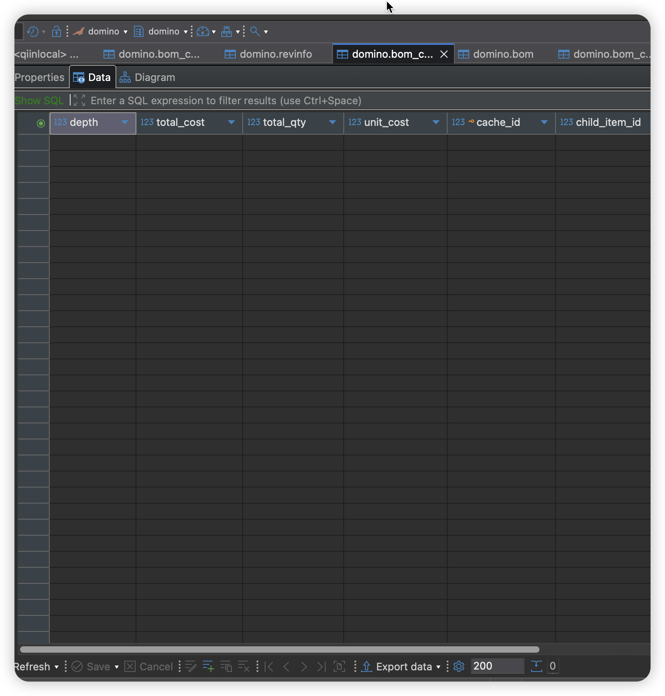

## 검증 결과 (이미지 포함)

### BOM CUD 이후 `bom_cost_cache`가 생성되지 않음 (의도된 동작)

위 이미지는 BOM 생성/수정/삭제(CUD) 작업이 수행된 이후에도  
`bom_cost_cache` 테이블에 **어떠한 행도 생성되지 않은 상태**를 보여준다.

이 상태는 오류나 누락이 아니라, 이번 리팩터링에서 **의도적으로 만든 정상 상태**이다.

리팩터링 이후 BOM CUD 흐름에서는 다음이 보장된다.

- BOM CUD 트랜잭션은:
  - `bom`
  - `bom_closure`
    만을 변경한다.
- 원가/소요량 계산 로직(`BomCacheBuilder`)은:
  - BOM CUD 과정에서 **절대 호출되지 않는다**
  - 이벤트, 리스너, 비동기 워커에 의해 **암묵적으로 실행되지 않는다**
- 그 결과:
  - BOM 구조가 변경되더라도 `bom_cost_cache`는 **비어 있는 상태로 유지**된다.

이 이미지는 다음 사실을 명확히 입증한다.

- BOM CUD가 더 이상 원가 계산을 **부수 효과(side effect)** 로 유발하지 않는다.
- BOM 구조 변경과 원가 계산은 **서로 다른 책임과 트랜잭션 경계**를 가진다.
- “BOM을 만들었는데 왜 비용이 계산됐는가?”라는 질문이 더 이상 발생하지 않는다.

즉, `bom_cost_cache`가 비어 있다는 것은  
“아직 명시적인 재빌드 API가 호출되지 않았다”는 **상태 자체를 정확히 표현**하는 것이다.

이 구조에서는 원가/소요량 계산이 다음 경우에만 발생한다.

- `POST /api/v1/boms/cache/rebuild`
- `POST /api/v1/boms/cache/refresh/{item-id}`

그 외의 모든 BOM CUD, 조회, 배치 입력 과정에서는  
원가 계산이 자동으로 실행되지 않는다.

이는 ERP 시스템에서 요구되는 다음 원칙을 만족시킨다.

- 계산은 **명시적으로 요청될 때만 실행된다**
- 계산 결과는 “마지막으로 계산된 스냅샷”으로서 의미를 가진다
- 데이터가 언제, 어떤 기준으로 계산되었는지 **설명 가능하다**

따라서 위 이미지에서 `bom_cost_cache`가 비어 있는 상태는  
이번 리팩터링이 의도한 **결과**이다.
